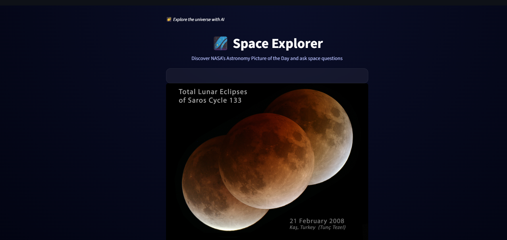
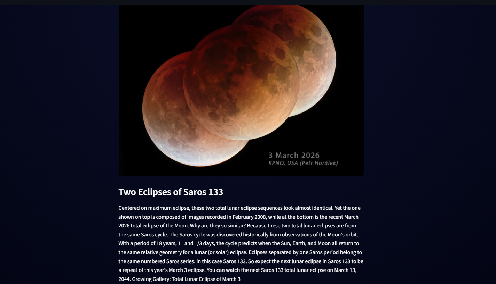
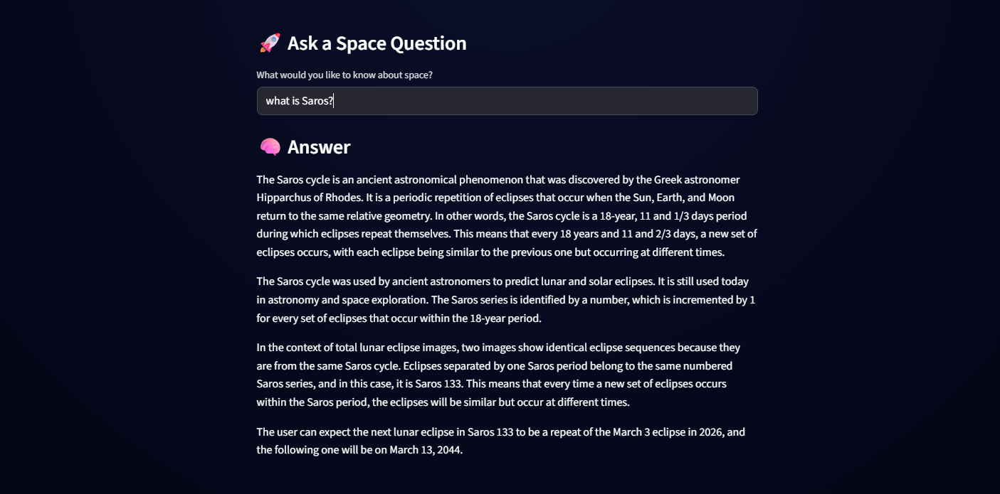

# Space Explorer Agent

An AI-powered space exploration app that displays NASA’s Astronomy Picture of the Day and lets users ask questions about space using an intelligent agent system.

Built with **Streamlit + CrewAI + NASA API**.

---

## Features

- Displays NASA's **Astronomy Picture of the Day (APOD)**
- AI agents analyze the image description
- Users can **ask space-related questions**
- Responses generated using a **multi-agent system**

Example questions:

- What galaxy is shown in this image?
- How far away is this object?
- What telescope captured this photo?
- How do nebulae form?

---

## How It Works

Two AI agents collaborate:

**NASA Context Reader**
- Reads the APOD title and description
- Extracts relevant astronomical context

**Answer Synthesizer**
- Uses that context
- Generates a clear explanation for the user

Agents run sequentially using **CrewAI**.

---

## Demo






---

## Installation

Clone the repository:

```bash
git clone https://github.com/yourusername/space-explorer-agent.git
cd space-explorer-agent
```

Install dependencies:

```bash
pip install -r requirements.txt
```

Create a `.env` file:

```
NASA_API_KEY=your_api_key_here
```

## LLM Configuration

This project uses a language model through **CrewAI** to answer space-related questions.

By default, the agent is configured to connect to an **Ollama server hosted at UNCW**:

```
http://lambda2.uncw.edu:11434
```

This server may only be accessible from the **UNCW campus network or VPN**.

### If you are outside the UNCW network

You may need to configure your own LLM endpoint. There are several options:

#### Option 1 — Run Ollama locally

Install Ollama and run a model locally.

Install Ollama:

https://ollama.com

Pull a model (example):

```bash
ollama pull llama3
```

Then update the `base_url` in `agent.py`:

```python
llm = LLM(
    model="ollama/llama3",
    base_url="http://localhost:11434"
)
```

---

#### Option 2 — Use a different LLM provider

CrewAI supports multiple providers such as:

- OpenAI
- Anthropic
- Google Gemini
- AWS Bedrock

You can modify the LLM configuration in `agent.py` to use your preferred provider.

Example (OpenAI):

```python
llm = LLM(
    model="gpt-4o-mini",
    provider="openai",
    api_key=os.getenv("OPENAI_API_KEY")
)
```

---

### Environment Variables

You may configure API keys using a `.env` file:

```
NASA_API_KEY=your_nasa_api_key
OPENAI_API_KEY=your_openai_api_key
```

---

This flexibility allows users to run the application with **their own local or cloud-based LLM setup**.

---

## Run the App

```bash
streamlit run app.py
```

The app will open in your browser.

---

## Technologies Used

- Streamlit
- CrewAI
- LiteLLM
- NASA APOD API
- Python

---

## Future Improvements

- Chat-style interface
- Animated starfield background
- Question history
- Support for additional NASA APIs

---

